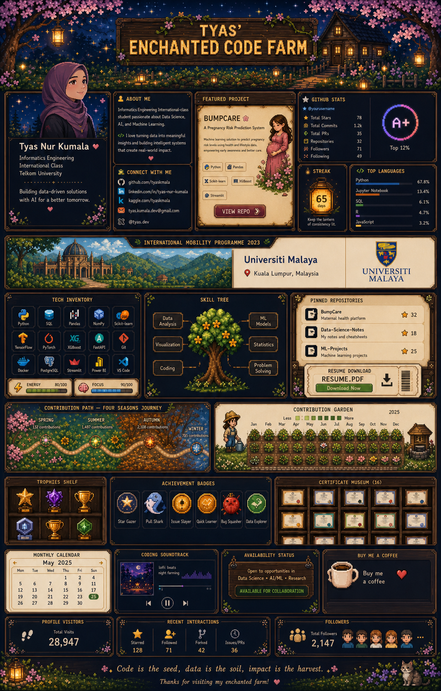

# 🌙 Tyas' Enchanted Code Farm

**Tyas Nur Kumala**  
Informatics Engineering — International Class, Telkom University  
Data Science · Artificial Intelligence · Machine Learning

## 📊 Live Farm Ledger

## 🌸 Featured Quest — BumpCare

An AI-powered maternal-health project that uses machine learning to support risk detection and better health insights.

## 🌏 International Mobility Programme

**Student Mobility Programme 2023**  
Universiti Malaya Students' Union · September 2023

Completed an international mobility programme at Universiti Malaya, expanding my academic perspective, cross-cultural communication, and global connections.

## 🏛️ Certificate Museum

<b>Open the collection — 16 certificates</b>

 

| Certificate | Issuer | Credential |
|---|---|---|
| Belajar Penerapan Data Science dengan Microsoft Fabric | Dicoding Indonesia | [Inspect](https://www.dicoding.com/certificates/6RPNGG0M9Z2M) |
| Machine Learning Terapan | Dicoding Indonesia | [Inspect](https://www.dicoding.com/certificates/07Z632W3JZQR) |
| Belajar Fundamental Pemrosesan Data | Dicoding Indonesia | [Inspect](https://www.dicoding.com/certificates/GRX53V6JYZ0M) |
| Belajar Fundamental Deep Learning | Dicoding Indonesia | [Inspect](https://www.dicoding.com/certificates/1RXYE58QQZVM) |
| Belajar Machine Learning untuk Pemula | Dicoding Indonesia | [Inspect](https://www.dicoding.com/certificates/0LZ0RK8Q3P65) |
| Belajar Fundamental Analisis Data | Dicoding Indonesia | [Inspect](https://www.dicoding.com/certificates/L4PQE7844PO1) |
| Memulai Pemrograman dengan Python | Dicoding Indonesia | [Inspect](https://www.dicoding.com/certificates/GRX53WYKKZ0M) |
| Financial Literacy 101 | Dicoding Indonesia | — |
| Belajar Dasar Structured Query Language (SQL) | Dicoding Indonesia | [Inspect](https://www.dicoding.com/certificates/6RPNRGKVRX2M) |
| Belajar Dasar Visualisasi Data | Dicoding Indonesia | [Inspect](https://www.dicoding.com/certificates/MRZMNY2EKPYQ) |
| Belajar Dasar AI | Dicoding Indonesia | [Inspect](https://www.dicoding.com/certificates/JMZVE3Y6RPN9) |
| Belajar Dasar Git dengan GitHub | Dicoding Indonesia | [Inspect](https://www.dicoding.com/certificates/1RXYE1W71ZVM) |
| Programming Logic 101 | Dicoding Indonesia | [Inspect](https://www.dicoding.com/certificates/JLX192W25P72) |
| Dasar Pemrograman untuk Pengembang Software | Dicoding Indonesia | [Inspect](https://www.dicoding.com/certificates/1OP82N5DLPQK) |
| Career Essentials in Generative AI | Microsoft & LinkedIn | — |
| Student Mobility Programme 2023 | Universiti Malaya Students' Union | — |

## 🎧 Coding Soundtrack

## 💌 Farm Mailbox

Open to collaboration in Data Science, AI/ML, research, and technology for meaningful impact.

*Code is the seed, data is the soil, impact is the harvest.*

