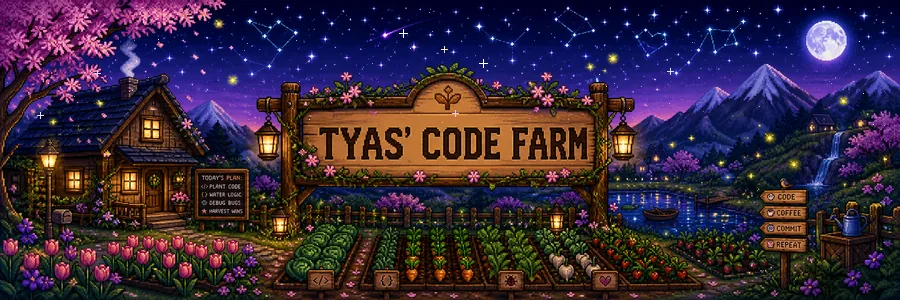

  
  <br/><br/>

  <a href="https://git.io/typing-svg">
    
  </a>
</div>

<table align="center">
  <tr>
    <td align="center" width="150"><a href="https://www.linkedin.com/in/tyas-nur-kumala-939a16262/"><br/><strong>LinkedIn</strong></a></td>
    <td align="center" width="150"><a href="mailto:tyasnurkumala26@gmail.com"><br/><strong>Farm Mail</strong></a></td>
    <td align="center" width="150"><a href="https://github.com/tyasnurkumala2?tab=followers"><br/><strong>Villagers</strong></a></td>
    <td align="center" width="150"><a href="https://github.com/tyasnurkumala2"><br/><strong>Visit Farm</strong></a></td>
  </tr>
</table>

##  About the Farmer


I'm **Tyas Nur Kumala**, an Informatics Engineering — International Class student at **Telkom University**. I enjoy turning data into useful insights and building intelligent solutions that create meaningful impact.

- 🔭 Building **BumpCare**, a maternal-health risk detection project.
- 🌾 Exploring Data Science, Machine Learning, Deep Learning, NLP, and Generative AI.
- 🌏 Completed the **Student Mobility Programme 2023** at Universiti Malaya.
- 📚 Always learning, one commit and one seed at a time.

```python
tyas = {
    "education": "Informatics Engineering — Telkom University",
    "focus": ["Data Science", "Artificial Intelligence", "Machine Learning"],
    "currently_learning": ["Deep Learning", "NLP", "Microsoft Fabric"],
    "featured_project": "BumpCare",
    "motto": "Plant curiosity, cultivate code, harvest impact."
}
```

##  Farmer's Inventory

<div align="center">
  &nbsp;&nbsp;
  &nbsp;&nbsp;
  &nbsp;&nbsp;
  
  <br/>
  <sub><b>Python · Machine Learning · Data · Developer Tools</b></sub><br/>
  <sub>TensorFlow · PyTorch · scikit-learn · PostgreSQL · MySQL · Git · Docker · Figma</sub>
</div>

##  Skills & Languages

### 💻 Programming Languages

<div align="center">
  
  &nbsp;
  
  <br/>
  <sub><b>Python · JavaScript · HTML5 · CSS3 · SQL</b></sub>
</div>

<br/>

<table>
<tr>
<td valign="top" width="50%">

### 🧠 Hard Skills

- 📊 Data Analysis & Visualization
- 🤖 Machine Learning & Deep Learning
- 💬 Natural Language Processing
- 🧹 Data Preprocessing & Feature Engineering
- 🧪 Model Evaluation & Experimentation
- 🗄️ SQL & Relational Databases
- 🌿 Git Version Control

</td>
<td valign="top" width="50%">

### 🌱 Soft Skills

- 🧩 Problem Solving & Critical Thinking
- 🤝 Teamwork & Collaboration
- 🎤 Communication & Presentation
- 🌤️ Adaptability & Continuous Learning
- ⏳ Time Management
- 🔬 Research & Analytical Thinking
- 🌏 Cross-cultural Collaboration

</td>
</tr>
<tr>
<td valign="top" width="50%">

### 🌏 Languages

<div align="center">
  
  <br/><br/>
  
</div>

</td>
<td valign="top" width="50%">

### 🧰 Tools & Technologies

<div align="center">
  
  <br/><br/>
  
  
  
  
</div>

</td>
</tr>
</table>

##  Featured Quest

| Project | What it grows | Explore |
|---|---|---|
| **BumpCare Capstone** | Maternal-health risk detection application | [Open Repository](https://github.com/tyasnurkumala2/BumpCare-Capstone-Project) |
| **BumpCare ML** | Machine-learning experiments and models | [Open Repository](https://github.com/tyasnurkumala2/BumpCare-ML) |

##  International Mobility Programme

> **Student Mobility Programme 2023**  
> Universiti Malaya Students' Union · September 2023

This international experience expanded my academic perspective, cross-cultural communication, and global connections.

<details open>
<summary><h2> Certificate Museum — 17 Collected</h2></summary>

> Tanggal hanya dicantumkan apabila tersedia pada sertifikat atau halaman kredensial. Tanda **—** berarti tidak tercantum pada bukti yang tersedia.

### 🌻 Data Science & Machine Learning

| Certificate | Issuer | Terbit | Kedaluwarsa | Credential |
|---|---|---:|---:|---|
| **Coding Camp 2025 — Machine Learning Engineer** | Dicoding & DBS Foundation | 7 Jul 2025 | — | [View PDF](./assets/certificates/coding-camp-2025-machine-learning-engineer.pdf) |
| Microsoft Fabric Data Science | Dicoding Indonesia | 28 Oct 2025 | 28 Oct 2028 | [View](https://www.dicoding.com/certificates/6RPNGG0M9Z2M) |
| Machine Learning Terapan | Dicoding Indonesia | 17 Jun 2025 | 17 Jun 2028 | [View](https://www.dicoding.com/certificates/07Z632W3JZQR) |
| Fundamental Pemrosesan Data | Dicoding Indonesia | 12 Jun 2025 | 12 Jun 2028 | [View](https://www.dicoding.com/certificates/GRX53V6JYZ0M) |
| Fundamental Deep Learning | Dicoding Indonesia | 11 Jun 2025 | 11 Jun 2028 | [View](https://www.dicoding.com/certificates/1RXYE58QQZVM) |
| Machine Learning untuk Pemula | Dicoding Indonesia | 10 Jun 2025 | 10 Jun 2028 | [View](https://www.dicoding.com/certificates/0LZ0RK8Q3P65) |
| Fundamental Analisis Data | Dicoding Indonesia | 24 Mar 2025 | 24 Mar 2028 | [View](https://www.dicoding.com/certificates/L4PQE7844PO1) |

### 🌷 Foundations & Other Achievements

| Certificate | Issuer | Terbit | Kedaluwarsa | Credential |
|---|---|---:|---:|---|
| Memulai Pemrograman dengan Python | Dicoding Indonesia | 2 Mar 2025 | 2 Mar 2028 | [View](https://www.dicoding.com/certificates/GRX53WYKKZ0M) |
| Financial Literacy 101 | Dicoding Indonesia | 27 Apr 2025 | 27 Apr 2028 | [View](https://www.dicoding.com/certificates/JLX19Q5N2P72) |
| Dasar SQL | Dicoding Indonesia | 23 Feb 2025 | 23 Feb 2028 | [View](https://www.dicoding.com/certificates/6RPNRGKVRX2M) |
| Dasar Visualisasi Data | Dicoding Indonesia | 20 Feb 2025 | 20 Feb 2028 | [View](https://www.dicoding.com/certificates/MRZMNY2EKPYQ) |
| Dasar AI | Dicoding Indonesia | 18 Feb 2025 | 18 Feb 2028 | [View](https://www.dicoding.com/certificates/JMZVE3Y6RPN9) |
| Dasar Git dengan GitHub | Dicoding Indonesia | 15 Feb 2025 | 15 Feb 2028 | [View](https://www.dicoding.com/certificates/1RXYE1W71ZVM) |
| Programming Logic 101 | Dicoding Indonesia | 15 Feb 2025 | 15 Feb 2028 | [View](https://www.dicoding.com/certificates/JLX192W25P72) |
| Dasar Pemrograman Pengembang Software | Dicoding Indonesia | 15 Feb 2025 | 15 Feb 2028 | [View](https://www.dicoding.com/certificates/1OP82N5DLPQK) |
| Career Essentials in Generative AI | Microsoft & LinkedIn | — | — | — |
| **Student Mobility Programme 2023** | Universiti Malaya & Telkom University | 21 Sep 2023 | — | [View Image](./assets/certificates/student-mobility-programme-2023-universiti-malaya.jpg) |

</details>

<details open>
<summary><h2> Farm Statistics</h2></summary>

<div align="center">

<!-- FARM_STATS_START -->
**7 public repositories · 100 contributions in the last year**
<!-- FARM_STATS_END -->

🌱 Active fields: **Machine Learning, Data Science, AI, and health technology**

📌 Featured harvests: **BumpCare Capstone · Machine Learning · BumpCare ML**

</div>

> Statistics are refreshed automatically every day using GitHub Actions and GitHub's official APIs.

</details>

##  Coding Soundtrack

<div align="center">
  
  <br/><br/>
  <a href="https://open.spotify.com/">
    
    <b>Open Tyas' Coding Playlist</b>
  </a>
</div>

##  Availability

<div align="center">
  
  <br/><br/>
  
  <b>Available for collaboration in Data Science, AI/ML, research, and technology for meaningful impact.</b>
  <br/><br/>
  <i>Code is the seed, data is the soil, impact is the harvest.</i>
</div>
