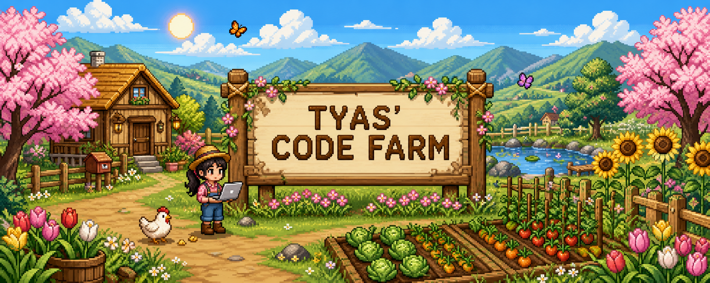
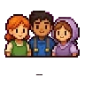
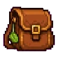
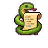
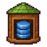
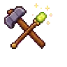
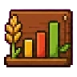

<div align="center">
  
  <br/><br/>

  <a href="https://git.io/typing-svg">
    
  </a>
</div>

<table align="center">
  <tr>
    <td align="center" width="150"><a href="https://www.linkedin.com/in/tyas-nur-kumala-939a16262/"><br/><strong>LinkedIn</strong></a></td>
    <td align="center" width="150"><a href="mailto:tyasnurkumala2@gmail.com"><br/><strong>Farm Mail</strong></a></td>
    <td align="center" width="150"><a href="https://github.com/tyasnurkumala2?tab=followers"><br/><strong>Villagers</strong></a></td>
    <td align="center" width="150"><a href="https://github.com/tyasnurkumala2"><br/><strong>Visit Farm</strong></a></td>
  </tr>
</table>

##  About the Farmer


I'm **Tyas Nur Kumala**, an Informatics Engineering — International Class student at **Telkom University**. I enjoy turning data into useful insights and building intelligent solutions that create meaningful impact.

- 🔭 Building **BumpCare**, a maternal-health risk detection project.
- 🌾 Exploring Data Science, Machine Learning, Deep Learning, NLP, and Generative AI.
- 🌏 Completed the **Student Mobility Programme 2023** at Universiti Malaya.
- 📚 Always learning, one commit and one seed at a time.

```python
tyas = {
    "education": "Informatics Engineering — Telkom University",
    "focus": ["Data Science", "Artificial Intelligence", "Machine Learning"],
    "currently_learning": ["Deep Learning", "NLP", "Microsoft Fabric"],
    "featured_project": "BumpCare",
    "motto": "Plant curiosity, cultivate code, harvest impact."
}
```

##  Farmer's Inventory

<div align="center">
  &nbsp;&nbsp;
  &nbsp;&nbsp;
  &nbsp;&nbsp;
  
  <br/>
  <sub><b>Python · Machine Learning · Data · Developer Tools</b></sub><br/>
  <sub>TensorFlow · PyTorch · scikit-learn · PostgreSQL · MySQL · Git · Docker · Figma</sub>
</div>

##  Featured Quest

| Project | What it grows | Explore |
|---|---|---|
| **BumpCare Capstone** | Maternal-health risk detection application | [Open Repository](https://github.com/tyasnurkumala2/BumpCare-Capstone-Project) |
| **BumpCare ML** | Machine-learning experiments and models | [Open Repository](https://github.com/tyasnurkumala2/BumpCare-ML) |

##  International Mobility Programme

> **Student Mobility Programme 2023**  
> Universiti Malaya Students' Union · September 2023

This international experience expanded my academic perspective, cross-cultural communication, and global connections.

<details open>
<summary><h2> Certificate Museum — 16 Collected</h2></summary>

### 🌻 Data Science & Machine Learning

| Certificate | Issuer | Credential |
|---|---|---|
| Microsoft Fabric Data Science | Dicoding Indonesia | [View](https://www.dicoding.com/certificates/6RPNGG0M9Z2M) |
| Machine Learning Terapan | Dicoding Indonesia | [View](https://www.dicoding.com/certificates/07Z632W3JZQR) |
| Fundamental Pemrosesan Data | Dicoding Indonesia | [View](https://www.dicoding.com/certificates/GRX53V6JYZ0M) |
| Fundamental Deep Learning | Dicoding Indonesia | [View](https://www.dicoding.com/certificates/1RXYE58QQZVM) |
| Machine Learning untuk Pemula | Dicoding Indonesia | [View](https://www.dicoding.com/certificates/0LZ0RK8Q3P65) |
| Fundamental Analisis Data | Dicoding Indonesia | [View](https://www.dicoding.com/certificates/L4PQE7844PO1) |

### 🌷 Foundations & Other Achievements

| Certificate | Issuer | Credential |
|---|---|---|
| Memulai Pemrograman dengan Python | Dicoding Indonesia | [View](https://www.dicoding.com/certificates/GRX53WYKKZ0M) |
| Financial Literacy 101 | Dicoding Indonesia | — |
| Dasar SQL | Dicoding Indonesia | [View](https://www.dicoding.com/certificates/6RPNRGKVRX2M) |
| Dasar Visualisasi Data | Dicoding Indonesia | [View](https://www.dicoding.com/certificates/MRZMNY2EKPYQ) |
| Dasar AI | Dicoding Indonesia | [View](https://www.dicoding.com/certificates/JMZVE3Y6RPN9) |
| Dasar Git dengan GitHub | Dicoding Indonesia | [View](https://www.dicoding.com/certificates/1RXYE1W71ZVM) |
| Programming Logic 101 | Dicoding Indonesia | [View](https://www.dicoding.com/certificates/JLX192W25P72) |
| Dasar Pemrograman Pengembang Software | Dicoding Indonesia | [View](https://www.dicoding.com/certificates/1OP82N5DLPQK) |
| Career Essentials in Generative AI | Microsoft & LinkedIn | — |
| Student Mobility Programme 2023 | Universiti Malaya Students' Union | — |

</details>

<details open>
<summary><h2> Farm Statistics</h2></summary>

<div align="center">

<!-- FARM_STATS_START -->
**7 public repositories · 100 contributions in the last year**
<!-- FARM_STATS_END -->

🌱 Active fields: **Machine Learning, Data Science, AI, and health technology**

📌 Featured harvests: **BumpCare Capstone · Machine Learning · BumpCare ML**

</div>

> Statistics are refreshed automatically every day using GitHub Actions and GitHub's official APIs.

</details>

##  Coding Soundtrack

<div align="center">
  <a href="https://open.spotify.com/"><b>♫ Open Tyas' Coding Playlist</b></a>
</div>

##  Availability

<div align="center">
  <b>🌾 Available for collaboration in Data Science, AI/ML, research, and technology for meaningful impact.</b>
  <br/><br/>
  <i>Code is the seed, data is the soil, impact is the harvest.</i>
</div>
